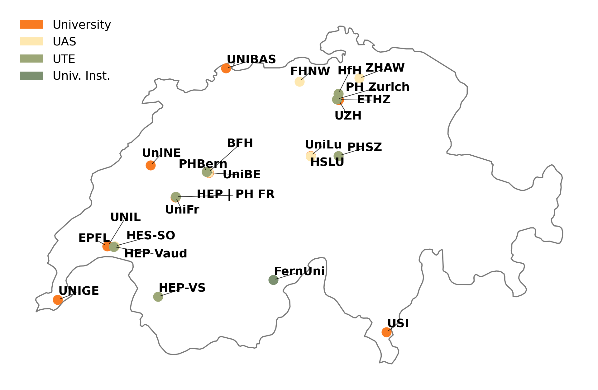
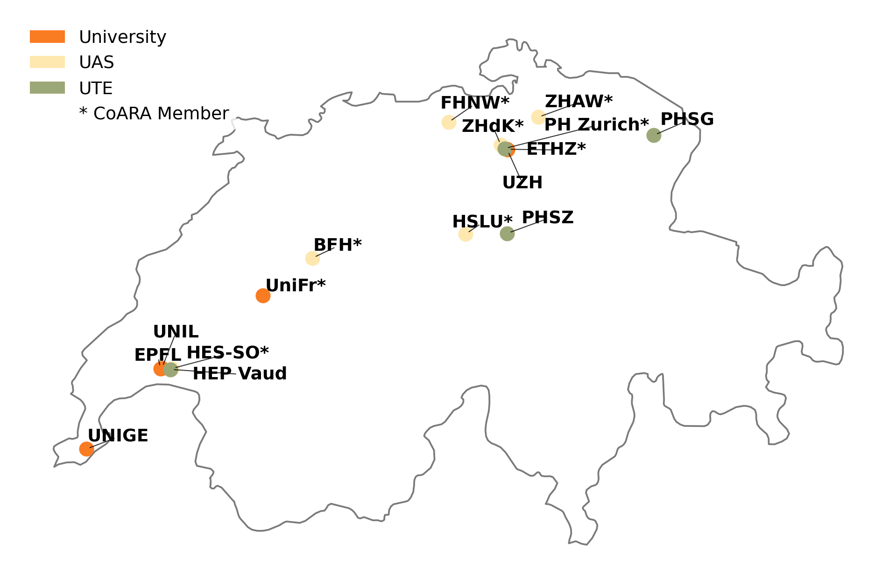

# {.col-2 style="grid-row: span 4;"}
## 📋 Overview
The **NAIF** (National Approach for Interoperable repositories and Findable research results) project aims to increase the visibility and findability of Swiss research output.  
This poster presents the results of the 6th SYoS workshop, attended by **27 stakeholders** from Swiss higher education institutions (HEIs) on 15 September 2025, alongside a planned **qualitative survey**.

**Track 1** focuses on the **responsible use of quantitative indicators** for research assessment, aligned with:  
📜 **DORA** — San Francisco Declaration on Research Assessment  
🤝 **CoARA** — Coalition for Advancing Research Assessment  
📊 **Leiden Manifesto** — Best practices for research metrics

## 🔬 Methods
### Workshop
* **Participants:** 27 stakeholders from Swiss HEIs, policymakers, and international experts
* **Focus:** Four key questions on QSI implementation and responsible use
* **Case Study:** ETH Zurich's approach to research monitoring

### Planned Survey
* **Target:** Swiss HEIs and relevant stakeholders (SNSF, SERI, etc.)
* **Scope:** Current practices, tool importance, and future needs
* **Format:** Questionnaire-guided expert interviews

## 🎯 Key Findings at a Glance
| Aspect | Current State |
|--------|---------------|
| 📈 **Framework Adoption** | Growing alignment with DORA, CoARA, and the Leiden Manifesto |
| ⚠️ **Implementation** | Struggles in translating declarations into practice |
| 🏛️ **Assessment Level** | Increasing focus on organizational monitoring over individual assessment |
| 📊 **Data Quality** | Identified as a critical prerequisite for meaningful metrics |

## Acknowledgments {.theme-minimalist}
We thank all workshop participants, Ginny Barbour (DORA Co-Chair), and the swissuniversities member libraries for their valuable contributions.

### Contact {.fullwidth}
**NAIF Track 1** Responsible use of quantitative indicators
🌐 eth-library.github.io/naif

### Partner Institutions

{style="width:100%;"}

# {.col-2 style="grid-row: span 4;"}
## ❓ Q1: How firmly is QSI embedded?
✅ **Adoption:** Significant momentum to align with DORA, CoARA, and the Leiden Manifesto.

⚠️ **Challenge:** Stakeholders struggle to translate these declarations into appropriate QSI practices.

💡 **Core Values:** Indicators must be transparent, contextual, and fair — serving to complement, not replace, expert judgment.

## Adoption of DORA & CoARA in Switzerland {.theme-minimalist}
### 24 DORA signatories

{style="width:100%;"}

### 16 CoARA signatories

{style="width:100%;"}

## ❓ Q2: Where are QSI currently used?
🏛️ **Organizational over Individual** QSI are favored for university or departmental monitoring, *not* for evaluating individual researcher output (based on the ETH Zurich case study).

🔬 **Research Profiles**: Tracking topics and their evolution over time.  
🌍 **Impact Analysis**: Analyzing citation patterns by discipline or country.  
🔗 **Network Analysis**: Mapping collaboration patterns.  
📖 **Strategic Initiatives**: Monitoring OA shares and funding sources.

## ❓ Q3: How important are QSI tools?
📊 **Data Quality First:** Metrics are often flawed or misapplied — meaningful analysis requires multiple sources and rigorous cleaning.

🎯 **Context-Driven:** Tools are only useful when purpose-driven — understand user needs first, then define the QSI.

🤝 **Collaboration:** Requires close cooperation between data specialists and subject experts.

## ❓ Q4: Future of responsible QSI?
🤝 **Expert Collaboration:** Integration of data, subject, and methodology specialists.

💬 **Dialogue-Based:** Clarifying purpose and limitations upfront.

🎯 **Context-First:** Building use cases before defining QSI.

🌐 **Holistic Scope:** Moving beyond citations to include ORD, Open Science, and media visibility.

## 📌 Conclusion & Key Takeaways
The NAIF project will develop **guidelines** for Swiss HEIs to apply transparent, context-specific research assessment aligned with international best practices by the end of 2026.

::: {style="font-size: 0.95em;"}
|   | Takeaway |
|---|----------|
| 1 | **Start with context**, not indicators |
| 2 | Prioritize **organizational monitoring** over individual assessment |
| 3 | **Data quality** is non-negotiable |
| 4 | **Multi-stakeholder dialogue** drives implementation |
:::